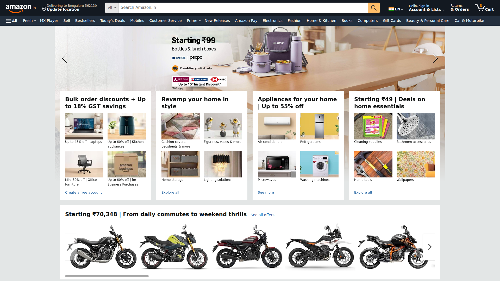
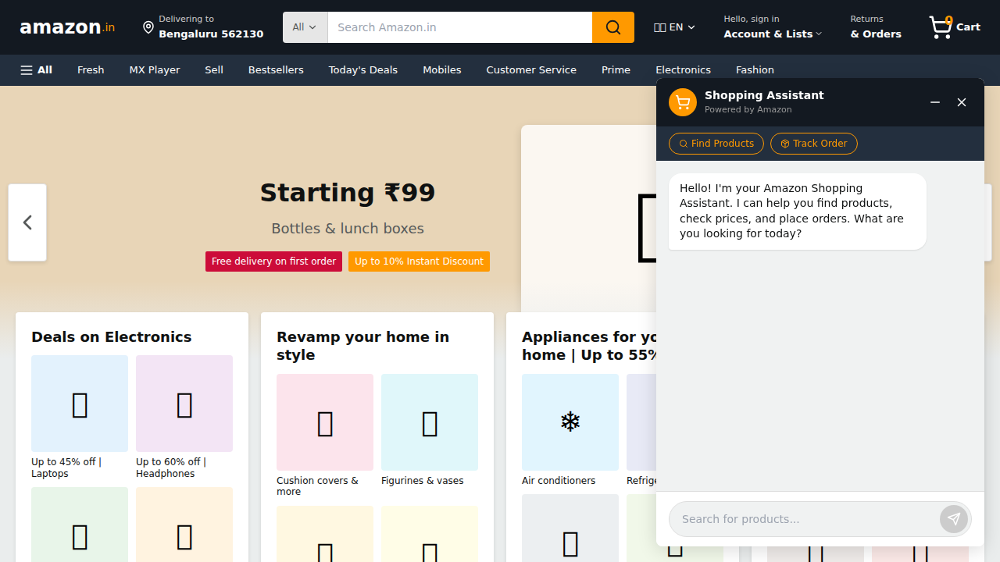
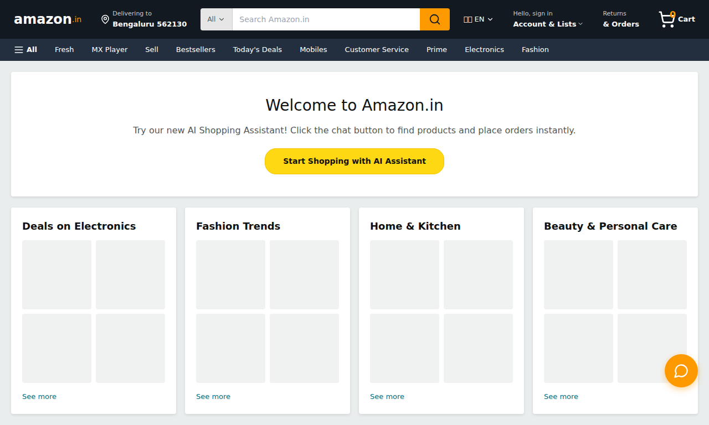

# Amazon India Shopping Chatbot Example

A fully functional shopping chatbot prototype generated using the Platform Prototype Skill.

## What This Example Shows

This example demonstrates how the Platform Prototype Skill can:
- Capture an existing platform's design (Amazon India)
- Extract exact colors, fonts, and spacing
- Generate a pixel-perfect Next.js prototype
- Implement complex functionality (search, cart, orders)

## Quick View

### Original Platform


### Generated Chatbot


### Full Prototype


## Features

- Smart product search across 11 products
- Shopping cart with real-time counter
- Order tracking system
- Price filtering ("laptop under 50000")
- Buy Now checkout flow
- Action buttons for quick interactions

## Design Tokens

Captured from Amazon India:

```json
{
  "colors": {
    "primary": {
      "orange": "#FF9900",
      "dark": "#131921"
    },
    "accent": {
      "yellow": "#FFD814"
    }
  },
  "typography": {
    "fontFamily": "Amazon Ember, Arial, sans-serif"
  }
}
```

See full tokens in [references/design-tokens.json](references/design-tokens.json)

## Files Included

- `FEATURES.md` - Complete feature documentation
- `CLAUDE.md` - Project setup and configuration
- `references/design-tokens.json` - Captured design tokens
- `references/screenshots/` - Platform and prototype screenshots

## Note

The actual prototype code is not included in this repository to keep it lightweight. However, using the Platform Prototype Skill with the same configuration will generate an identical prototype.

## How to Generate This

1. Install the Platform Prototype Skill
2. Create a project with this CLAUDE.md configuration:
   ```markdown
   PLATFORM_URL=https://www.amazon.in/
   PAGES_TO_CAPTURE=/homepage
   ```
3. Tell Claude: "Create a shopping chatbot where users can search products and place orders"
4. Claude will generate the complete prototype

## Learn More

- [Platform Prototype Skill Documentation](../../README.md)
- [Quick Start Guide](../../QUICKSTART.md)
- [Installation Instructions](../../INSTALL.md)
