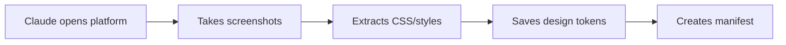

# Real Prototypes

> **Capture any web platform's design and generate pixel-perfect Next.js prototypes that match the original style**

A Claude Code skill that helps product managers and developers rapidly prototype new features for existing platforms by capturing visual references and generating production-ready Next.js + Tailwind code.

[](https://www.npmjs.com/package/real-prototypes-skill)
[](https://opensource.org/licenses/Apache-2.0)
[](https://claude.ai/code)

---

## What This Skill Does

This skill enables Claude Code to:
1. **Capture** - Screenshot and extract design tokens (colors, fonts) from any web platform
2. **Analyze** - Understand the platform's visual language and component patterns
3. **Generate** - Create new feature prototypes that perfectly match the original platform's design

Perfect for:
- Product managers prototyping new features
- Developers building feature mockups
- Design teams maintaining design consistency
- Agencies creating client prototypes

---

## Quick Start

### Installation

**Option 1: npx (Recommended)**

```bash
# Install to current project
npx real-prototypes-skill

# Or install globally
npx real-prototypes-skill --global
```

**Option 2: Clone Repository**

```bash
# Navigate to your Claude Code skills directory
cd ~/.claude/skills

# Clone this repository
git clone https://github.com/kaidhar/real-prototypes-skill.git
```

**Option 3: Add to Existing Project**

```bash
# In your project directory
cd your-project/.claude/skills

# Clone or add as submodule
git clone https://github.com/kaidhar/real-prototypes-skill.git
```

### Verify Installation

After installation, you should see the skill in your `.claude/skills/` directory:

```
.claude/skills/
└── real-prototypes-skill/
    ├── SKILL.md
    ├── scripts/
    ├── templates/
    └── ...
```

---

## Usage

### Example 1: Build an Amazon-Style Chatbot

```bash
# Open Claude Code in your project
cd your-project
claude
```

Then tell Claude:
```
I want to create a shopping chatbot for Amazon India that matches
their design. It should allow users to search products, add to cart,
and place orders.
```

Claude will:
1. Capture Amazon India's design (colors, fonts, spacing)
2. Extract design tokens to `references/design-tokens.json`
3. Generate a functional Next.js chatbot prototype
4. Create components with TypeScript + Tailwind CSS

### Example 2: Create a Dashboard Widget

```
Create a notifications panel for Slack that matches their design system.
It should show recent messages and allow marking as read.
```

### Example 3: Build a Checkout Flow

```
Generate a checkout modal for Shopify that matches their merchant admin
design. Include payment selection and order summary.
```

---

## Prerequisites

### Required

- **Claude Code CLI** (v0.5.0+)
  ```bash
  # Install from https://claude.ai/code
  npm install -g @anthropic-ai/claude-code
  ```

- **Node.js 18+**
  ```bash
  node --version  # Should be v18.0.0 or higher
  ```

- **agent-browser-skill** (installed automatically with npx)

### Optional (Enhances Features)

- **vercel-react-best-practices** - For optimized React code
- **web-design-guidelines** - For WCAG 2.1 AA accessibility

---

## What Gets Generated

### Project Structure

```
projects/
└── your-prototype-name/
    ├── project.json              # Project metadata
    ├── references/               # Captured platform assets
    │   ├── manifest.json         # Page inventory
    │   ├── design-tokens.json    # Extracted design system
    │   ├── screenshots/          # Platform screenshots
    │   │   ├── homepage-desktop.png
    │   │   ├── product-page.png
    │   │   └── ...
    │   └── html/                 # Saved HTML for reference
    └── prototype/                # Generated Next.js app
        ├── src/
        │   ├── app/
        │   │   ├── page.tsx      # Main page
        │   │   └── layout.tsx
        │   └── components/       # Feature components
        ├── package.json
        ├── tailwind.config.js
        └── tsconfig.json
```

### Design Tokens Example

```json
{
  "colors": {
    "primary": {
      "orange": "#FF9900",
      "dark": "#131921"
    },
    "text": {
      "primary": "#0F1111",
      "secondary": "#565959",
      "link": "#007185"
    },
    "button": {
      "yellow": "#FFD814",
      "orange": "#FFA41C"
    }
  },
  "typography": {
    "fontFamily": "Amazon Ember, Arial, sans-serif",
    "fontSize": {
      "xs": "11px",
      "sm": "12px",
      "base": "14px",
      "lg": "18px"
    }
  },
  "spacing": {
    "xs": "4px",
    "sm": "8px",
    "md": "12px",
    "lg": "16px"
  }
}
```

---

## Running Your Prototype

```bash
# Navigate to the generated prototype
cd projects/your-prototype-name/prototype

# Install dependencies
npm install

# Start development server
npm run dev

# Open browser
open http://localhost:3000
```

---

## Configuration (Optional)

### Set Platform Credentials

Create `CLAUDE.md` in your project root:

```markdown
## Platform Credentials

PLATFORM_URL=https://www.example.com
PLATFORM_EMAIL=demo@example.com
PLATFORM_PASSWORD=demo_password

## Capture Settings

PAGES_TO_CAPTURE=/dashboard,/settings,/profile
CAPTURE_MODE=manual
VIEWPORT_WIDTH=1920
VIEWPORT_HEIGHT=1080
```

### Customize Capture Behavior

Create `capture-config.json`:

```json
{
  "platform": {
    "name": "My Platform",
    "baseUrl": "https://app.example.com"
  },
  "capture": {
    "mode": "auto",
    "maxPages": 50,
    "viewports": [
      { "name": "desktop", "width": 1920, "height": 1080 },
      { "name": "mobile", "width": 375, "height": 812 }
    ]
  }
}
```

---

## Examples

Check out the [examples directory](./.claude/skills/real-prototypes-skill/examples/) for complete projects:

### Amazon Chatbot
A fully functional shopping assistant with:
- Smart product search (11 products, 4 categories)
- Shopping cart with real-time counter
- Order tracking system
- Checkout flow

**[View Example →](./.claude/skills/real-prototypes-skill/examples/amazon-chatbot/)**

---

## How It Works

### Phase 1: Capture (Automatic)



The skill uses `agent-browser-skill` to:
- Navigate to the target platform
- Capture full-page screenshots
- Extract computed styles from DOM
- Identify color palette, fonts, spacing
- Save everything to `references/`

### Phase 2: Discovery (Interactive)

Claude asks you:
- What feature are you building?
- What functionality is needed?
- Any specific interactions?
- Mobile or desktop (or both)?

### Phase 3: Generation (Automatic)

Claude generates:
- TypeScript React components
- Tailwind CSS styling using exact colors
- Functional features (state management, API calls, etc.)
- Responsive layouts
- Accessible markup (ARIA labels, semantic HTML)

---

## Advanced Usage

### CLI Tool

The skill includes a CLI for project management:

```bash
# Create new project
npx real-prototypes-skill
cd .claude/skills/real-prototypes-skill
node cli.js new --project my-app

# Capture platform design
node cli.js capture --project my-app --url https://example.com

# Validate design tokens
node cli.js validate --project my-app --phase post-capture

# Run full pipeline
node cli.js pipeline --project my-app --url https://example.com
```

### Validation Gates

The skill enforces quality gates:

- **Post-Capture**: Ensures minimum pages, colors, and screenshots
- **Pre-Generation**: Verifies design tokens and manifests exist
- **Post-Generation**: Checks colors match design tokens

---

## Contributing

Contributions welcome! Here's how:

1. **Fork** this repository
2. **Create** a feature branch: `git checkout -b feature/my-feature`
3. **Commit** your changes: `git commit -m 'Add my feature'`
4. **Push** to the branch: `git push origin feature/my-feature`
5. **Open** a Pull Request

### Development Setup

```bash
# Clone the repository
git clone https://github.com/kaidhar/real-prototypes-skill.git
cd real-prototypes-skill

# Test locally
cd .claude/skills/real-prototypes-skill/examples/amazon-chatbot/prototype
npm install
npm run dev
```

---

## Troubleshooting

### "agent-browser-skill not found"

The npx installer should install this automatically. If not:
```bash
cd ~/.claude/skills
git clone https://github.com/anthropics/agent-browser-skill.git
```

### "Colors don't match the captured design"

Ensure you're using design tokens:
```typescript
// Correct - using exact hex values
style={{ backgroundColor: "#FF9900" }}

// Wrong - using Tailwind defaults
className="bg-orange-500"
```

### "Next.js compilation errors"

```bash
# Clear Next.js cache
rm -rf .next
npm install
npm run dev
```

### "Port 3000 already in use"

```bash
# Kill process on port 3000
npx kill-port 3000

# Or specify different port
PORT=3001 npm run dev
```

---

## License

Apache 2.0 License - See [LICENSE](LICENSE) file for details.

---

## Acknowledgments

- **Anthropic** - For Claude Code and Claude AI
- **Vercel** - For Next.js framework
- **Tailwind CSS** - For utility-first styling
- **Playwright** - For browser automation

---

## Links

- [Documentation](./.claude/skills/real-prototypes-skill/SKILL.md)
- [Report Issues](https://github.com/kaidhar/real-prototypes-skill/issues)
- [Discussions](https://github.com/kaidhar/real-prototypes-skill/discussions)
- [Examples](./.claude/skills/real-prototypes-skill/examples/)

---

Made with care for the Claude Code community
